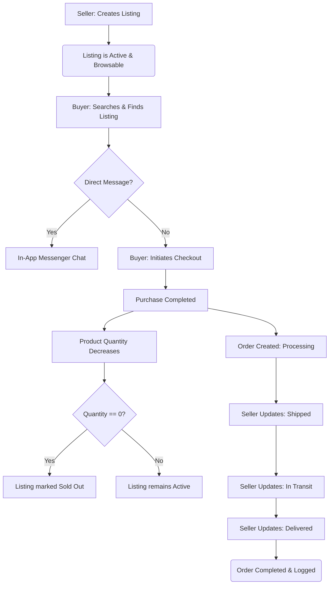

# HerCraft Hub – Website Walkthrough & Functional Guide

This document provides a comprehensive walkthrough of the HerCraft Hub web application, detailing the visitor, buyer, seller, and administrator user journeys, page flows, and features from start to finish.

---

## 🗺️ System Overview & Lifecycle

Below is the conceptual flow representing the listing creation, purchase, and delivery tracking cycle within HerCraft Hub:

---

## 🌐 1. Guest & Visitor Journey

### A. The Landing Page (`index.php`)
When a visitor arrives at the site, they are greeted by a custom, vintage-themed brand environment tailored for South African crafts:
*   **Hero Banner:** Introduction highlighting the C2C marketplace built for women. Action buttons allow users to either browse listings or start selling.
*   **Category Badges:** Filter options linking directly to the browsing page: *Tech Crafts*, *Handmade*, *Digital Art*, *Accessories*, *Bundles*, and *Beauty Tech*.
*   **Featured Listings:** Dynamic grid showcasing the four most recently added active products. Each listing displays the title, price, category badge, and image.
*   **Feature Cards:** Explanations of core platform values: Verified Sellers, Secure Payments, Mobile Friendly design, and Easy Setup.

### B. Catalog Browsing & Filtering (`browse.php`)
Visitors can explore products by clicking "Browse Listings" or selecting a category:
*   **Search Engine:** Text input allows filtering by product titles or descriptions.
*   **Category Sorting:** Selecting a category badge limits listings to that category.
*   **Listing Grid:** Display of active items with clear indicator cards. Clicking on a card takes the visitor to the product details page.

### C. Product Detail View (`listing.php`)
A detailed view of a single listing:
*   **Media Gallery:** Displays the uploaded product image.
*   **Product Information:** Lists title, category, price, condition status (*New*, *Like New*, *Good*, *Fair*), location, and quantity available.
*   **Seller Information Block:** Displays the seller’s name, verification badge, and physical location.
*   **Interactions:**
    *   *Wishlist Toggle:* Saves the item to the buyer's profile (requires authentication).
    *   *Direct Messaging:* Connects buyers directly to the seller via an in-app messaging field.
    *   *Purchase Buttons:* Adds the item to the checkout process.

---

## 🔑 2. Identity Verification & Account Management

### A. User Registration (`register.php` & `php/register_action.php`)
*   **Input Fields:** Full Name, Email, Password, and Role selection.
*   **Role Division:**
    *   **Buyer:** Can browse, save wishlists, contact sellers, make purchases, and track orders.
    *   **Seller:** Can set up a shop, post/edit listings, manage listings, view earnings metrics, and update shipping details.
*   **Validation:** Email uniqueness checks and secure password hashing via `PASSWORD_DEFAULT`.

### B. Secure Login (`login.php` & `php/login_action.php`)
*   Validates user credentials against hashed passwords stored in the database.
*   Initializes secure user session variables: `user_id`, `full_name`, `role`, and verification statuses.
*   Redirects users based on their role (e.g., Admin is sent to `/admin`, Sellers and Buyers are sent to their dashboards).

### C. Profile Management (`profile.php` & `php/update_profile.php`)
Allows logged-in users to update their profile settings:
*   **Avatar Image Upload:** Supports uploading custom profile pictures, which are resized and stored inside `uploads/avatars/`.
*   **Bio & Location details:** Allows sellers to customize their store description and select their shipping region.
*   **Security settings:** Fields to safely update passwords and contact emails.

---

## 🛒 3. The Buyer Experience

### A. Personal Dashboard (`dashboard.php`)
Once logged in, buyers have access to a dashboard:
*   **Wishlist Manager:** Displays a clean grid of all saved items. Users can view listings or click to remove them.
*   **Purchase History Tracker:** Shows details of all previous transactions, including the date, total price, and shipping tracking links.
*   **Inbox/Messages:** Access to all conversations initiated with sellers.

### B. Direct Messaging (`message.php` & `php/message_action.php`)
*   Allows buyers and sellers to message each other about a specific product.
*   Conversations are grouped by contact and display message histories.
*   Unread message alerts notify users of new responses.

### C. Checkout & Purchase Flow (`checkout.php` & `php/checkout_action.php`)
When a buyer clicks "Buy Now" on a listing:
*   **Order Details Summary:** Displays item title, price, selected quantity, and seller location.
*   **Delivery Address:** Text field to input delivery details.
*   **Delivery Fee:** Automatically calculated shipping cost (flat base rate of R99.00).
*   **Charity Contribution:** An optional field where buyers can add a donation (e.g. supporting women-owned craft cooperatives).
*   **Total Sum:** Displays the final total (`Item Total + Delivery Fee + Charity Donation`).
*   **Transaction Processing:**
    *   Updates the product inventory quantity.
    *   If quantity reaches `0`, the listing is marked as sold out.
    *   Logs transaction details in the `sales` table.
    *   Initializes the tracking status to `Processing`.

### D. Order & Delivery Tracking (`track_order.php`)
Allows buyers to track the delivery progress of their orders:
*   **Visual Status Tracker:** A horizontal timeline mapping the order status:
    `Processing` ➔ `Shipped` ➔ `In Transit` ➔ `Delivered`
*   **Order Details Card:** Displays product image, purchase timestamp, delivery address, and price.

---

## 👩‍🎨 4. The Seller Experience

### A. Seller Dashboard (`dashboard.php`)
Sellers are greeted by an analytics and inventory dashboard:
*   **Statistics Board:** Core metrics summaries showing *Active Listings*, *Sold Listings*, and *Total Earnings (R)*.
*   **Add Listing Button:** Quick access link to add new items for sale.
*   **Inventory Listings:** List of items currently posted, showing status, quantity, price, and actions to edit or delete.
*   **Sales & Orders Panel:** Details of all sales made, showing customer name, delivery address, price, and tracking status.
*   **Tracking Status Updater:** A form dropdown allowing sellers to update the tracking state (`Processing`, `Shipped`, `In Transit`, `Delivered`) to keep the buyer updated.

### B. Creating & Editing Listings (`sell.php` & `edit_listing.php`)
*   **Adding Listings:** Fields for Title, Category, Price (ZAR), Quantity, Condition, Description, and Product Image upload.
*   **Editing Listings:** Pre-populates all inputs from the database and allows updating images, descriptions, or prices.
*   **Soft Deactivation:** Allows sellers to temporarily hide a listing from the shop without deleting transaction histories.

---

## 👑 5. The Administrator Experience (`admin/`)

Administrators have access to the administrative panel located at `/admin/index.php`.

### A. Admin Dashboard (`admin/index.php`)
Provides a bird's-eye view of all platform activity:
*   **System Statistics:** Counters for *Total Users*, *Registered Sellers*, *Registered Buyers*, *Total Listings*, *Active Listings*, and *Sold Items*.
*   **Recent Signups:** Overview list of the newest registered users.
*   **Recent Sales:** List of the latest completed transactions.

### B. User Management (`admin/users.php` & `admin/create_user.php`)
*   **User Registry:** List of all registered users, showing role, status (active/deactivated), and verification status.
*   **Creation & Edits:** Allows admins to create new users or manually update profiles.
*   **Account Controls:** Allows deactivating violating users or manually verifying sellers.

### C. Listing Moderation (`admin/listings.php`)
*   Shows all items posted on the platform.
*   Provides actions to edit listings or deactivate them to remove them from public view.

### D. Sales Audit (`admin/sales.php`)
*   A log containing every transaction completed on the platform.
*   Displays transaction timestamps, seller names, buyer names, delivery addresses, and total costs (including delivery and charity contributions).
