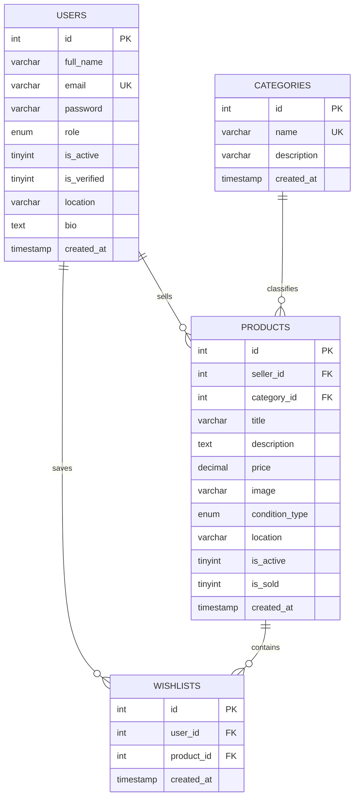
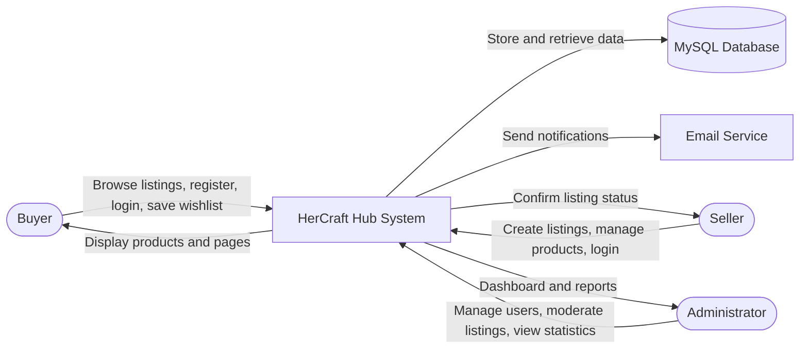
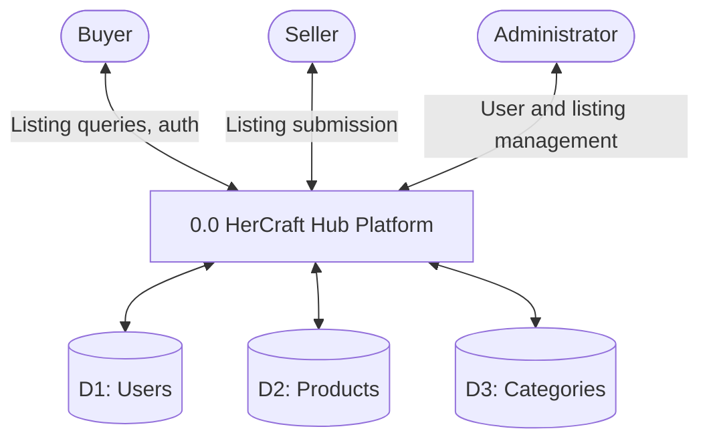
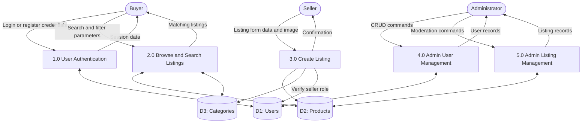
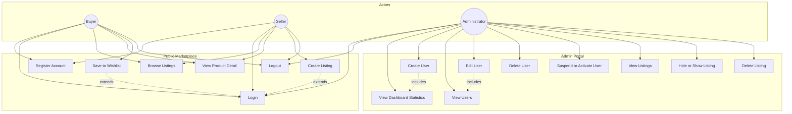

# HerCraft Hub

## ITECA3-12 Project Deliverable 2

### C2C E-Commerce Platform Prototype

**Student Name:** [Your Name]  
**Student Number:** [Your Number]  
**Module:** ITECA3-12  
**Due Date:** Block 2, Week 5  
**Live URL:** [Insert hosted website URL]  
**GitHub Repository:** [Insert GitHub URL]

---

## Table of Contents

1. [Introduction (Section 2.1)](#21-introduction)
2. [Prototyping (Section 2.2)](#22-prototyping)
3. [Designing (Section 2.3)](#23-designing)
4. [Coding (Section 2.4)](#24-coding)
5. [Conclusion (Section 2.5)](#25-conclusion)

---

## 2.1 Introduction

HerCraft Hub is a Customer-to-Customer (C2C) e-commerce platform designed for women in South Africa who create and sell handmade goods, tech crafts, and digital products. The platform enables individual consumers to list, browse, and purchase items directly from one another without intermediary businesses, fulfilling the mandatory C2C model specified in the project brief.

The prototype comprises two integrated web applications: a public marketplace website and an administrative management portal. The public site supports user registration, authentication, product browsing, listing creation, and product detail views. The admin site implements Role-Based Access Control (RBAC) with three user types (Buyer, Seller, and Administrator), allowing administrators to create, display, update, and delete user accounts and manage product listings.

The technical stack consists of HTML5, CSS3, JavaScript, PHP, and MySQL. Bootstrap 5.3 provides responsive layout components, while Tabler Icons supply consistent interface iconography. Server-side logic uses native PHP with prepared MySQL statements for authentication and data persistence. The application is hosted on a live web server to meet submission requirements.

**Word count:** 148

---

## 2.2 Prototyping

Responsive prototypes were developed to demonstrate how each page renders across three viewport categories: desktop (1280px and above), tablet (768px to 1024px), and smartphone (375px to 480px). Bootstrap 5 grid utilities and media queries in `css/style.css` and `admin/css/admin.css` ensure layout adaptation.

### 2.2.a Main Website

Insert screenshots in the table below. Capture each page using browser Developer Tools (F12) with device emulation enabled.


| Page                           | Desktop (1280px) | Tablet (768px)  | Mobile (375px)  |
| ------------------------------ | ---------------- | --------------- | --------------- |
| Home (`index.php`)             | Home desktop     | Home tablet     | Home mobile     |
| Browse Listings (`browse.php`) | Browse desktop   | Browse tablet   | Browse mobile   |
| Product Detail (`listing.php`) | Listing desktop  | Listing tablet  | Listing mobile  |
| Sell Item (`sell.php`)         | Sell desktop     | Sell tablet     | Sell mobile     |
| Login (`login.php`)            | Login desktop    | Login tablet    | Login mobile    |
| Register (`register.php`)      | Register desktop | Register tablet | Register mobile |


**Main website prototype features illustrated:**

- Vintage Pantone colour palette with Cormorant Garamond headings and Poppins body text
- Sticky navigation with session-aware links (Login, Join Free, or Dashboard and Logout)
- Product listing cards with category badges, price display, and hover interactions
- Client-side search, category filter, price range, and sort controls on the browse page
- Authentication forms with password visibility toggle and strength indicator
- Dark mode toggle persisted via browser localStorage

### 2.2.b Admin Website


| Page                                   | Desktop (1280px)        | Tablet (768px)         | Mobile (375px)         |
| -------------------------------------- | ----------------------- | ---------------------- | ---------------------- |
| Dashboard (`admin/index.php`)          | Admin dashboard desktop | Admin dashboard tablet | Admin dashboard mobile |
| Manage Users (`admin/users.php`)       | Admin users desktop     | Admin users tablet     | Admin users mobile     |
| Create User (`admin/create_user.php`)  | Create user desktop     | Create user tablet     | Create user mobile     |
| Edit User (`admin/edit_user.php`)      | Edit user desktop       | Edit user tablet       | Edit user mobile       |
| Manage Listings (`admin/listings.php`) | Admin listings desktop  | Admin listings tablet  | Admin listings mobile  |


**Admin website prototype features illustrated:**

- Sidebar navigation with Dashboard, Users, and Listings sections
- RBAC gate restricting all admin routes to users with role `admin`
- Statistical dashboard cards (total users, sellers, buyers, listings)
- User management table with search, role filter, suspend, edit, and delete actions
- Listing management with hide/show toggle and delete functionality

**Screenshot capture notes:**

Responsive prototypes were captured at **1280×900** (desktop), **768×1024** (tablet), and **375×812** (mobile) using the automated script `scripts/capture-screenshots.mjs`. All images are stored in `docs/screenshots/main/` and `docs/screenshots/admin/`. Re-capture locally with:

```powershell
cd C:\xampp\htdocs\hercrafthub
npm run screenshots
```

Ensure Apache and MySQL are running in XAMPP before executing the script.

---

## 2.3 Designing

### 2.3.a Class Responsibility Collaborator (CRC) Cards

#### CRC Card 1: User


|                      |                                                                                                                                                                                      |
| -------------------- | ------------------------------------------------------------------------------------------------------------------------------------------------------------------------------------ |
| **Class**            | User                                                                                                                                                                                 |
| **Parent Class**     | None                                                                                                                                                                                 |
| **Subclasses**       | Buyer, Seller, Administrator                                                                                                                                                         |
| **Responsibilities** | Store account credentials and profile data; authenticate via email and password; enforce role permissions (buyer, seller, admin); track account status (active, suspended, verified) |
| **Collaborators**    | Product (as seller), Wishlist, AuthController, AdminController                                                                                                                       |


#### CRC Card 2: Product


|                      |                                                                                                                                                             |
| -------------------- | ----------------------------------------------------------------------------------------------------------------------------------------------------------- |
| **Class**            | Product                                                                                                                                                     |
| **Parent Class**     | None                                                                                                                                                        |
| **Subclasses**       | None                                                                                                                                                        |
| **Responsibilities** | Store listing title, description, price, condition, and image; associate with a seller and category; track active and sold status; support admin moderation |
| **Collaborators**    | User (seller), Category, Wishlist, ListingController                                                                                                        |


#### CRC Card 3: Category


|                      |                                                                                                                                            |
| -------------------- | ------------------------------------------------------------------------------------------------------------------------------------------ |
| **Class**            | Category                                                                                                                                   |
| **Parent Class**     | None                                                                                                                                       |
| **Subclasses**       | None                                                                                                                                       |
| **Responsibilities** | Define product classification groups; provide filter options for browse functionality; maintain referential integrity with product records |
| **Collaborators**    | Product                                                                                                                                    |


#### CRC Card 4: AuthController


|                      |                                                                                                                                                           |
| -------------------- | --------------------------------------------------------------------------------------------------------------------------------------------------------- |
| **Class**            | AuthController                                                                                                                                            |
| **Parent Class**     | None                                                                                                                                                      |
| **Subclasses**       | None                                                                                                                                                      |
| **Responsibilities** | Process login and registration requests; validate credentials; hash passwords with bcrypt; initialise PHP session variables; redirect users based on role |
| **Collaborators**    | User, DatabaseConnection                                                                                                                                  |


#### CRC Card 5: AdminController


|                      |                                                                                                                                                 |
| -------------------- | ----------------------------------------------------------------------------------------------------------------------------------------------- |
| **Class**            | AdminController                                                                                                                                 |
| **Parent Class**     | None                                                                                                                                            |
| **Subclasses**       | None                                                                                                                                            |
| **Responsibilities** | Enforce RBAC admin-only access; perform CRUD operations on users and listings; toggle account and listing status; generate dashboard statistics |
| **Collaborators**    | User, Product, DatabaseConnection                                                                                                               |


#### CRC Card 6: DatabaseConnection


|                      |                                                                                                                                 |
| -------------------- | ------------------------------------------------------------------------------------------------------------------------------- |
| **Class**            | DatabaseConnection                                                                                                              |
| **Parent Class**     | None                                                                                                                            |
| **Subclasses**       | None                                                                                                                            |
| **Responsibilities** | Establish MySQL connection via mysqli; set UTF-8 character encoding; provide connection object to all data-access collaborators |
| **Collaborators**    | AuthController, AdminController, ListingController                                                                              |


---

### 2.3.b Enhanced Entity Relationship Diagram (EERD)




**EERD enhancements:**

- **Specialisation:** The `role` attribute in `USERS` implements disjoint specialisation into Buyer, Seller, and Administrator subtypes without separate tables.
- **Referential integrity:** `ON DELETE CASCADE` on seller and wishlist foreign keys; `ON DELETE RESTRICT` on category to prevent orphaned product records.
- **Unique constraints:** Email uniqueness on users; composite unique constraint on wishlists (user_id, product_id).

---

### 2.3.c Context Diagram




The context diagram defines HerCraft Hub as a single system boundary interacting with three external entities (Buyer, Seller, Administrator), one data store (MySQL Database), and one optional external service (Email Service for future notification features).

---

### 2.3.d Data Flow Diagram (DFD)

#### Level 0 (Context Level)




#### Level 1 (Process Decomposition)




---

### 2.3.e Use Case Diagram




**Use case notes:**

- Sellers inherit all buyer capabilities plus listing creation.
- Admin login redirects to the admin dashboard rather than the public homepage.
- Create Listing requires an authenticated session with role `seller` or `admin`.

---

### 2.3.f Database Design (Schema)

The complete schema is provided in `database/schema.sql`. Table structures are summarised below.

**Table: users**


| Column      | Type                           | Constraints                 |
| ----------- | ------------------------------ | --------------------------- |
| id          | INT                            | PRIMARY KEY, AUTO_INCREMENT |
| full_name   | VARCHAR(150)                   | NOT NULL                    |
| email       | VARCHAR(255)                   | NOT NULL, UNIQUE            |
| password    | VARCHAR(255)                   | NOT NULL                    |
| role        | ENUM('buyer','seller','admin') | NOT NULL, DEFAULT 'buyer'   |
| is_active   | TINYINT(1)                     | NOT NULL, DEFAULT 1         |
| is_verified | TINYINT(1)                     | NOT NULL, DEFAULT 0         |
| location    | VARCHAR(150)                   | NULL                        |
| bio         | TEXT                           | NULL                        |
| created_at  | TIMESTAMP                      | DEFAULT CURRENT_TIMESTAMP   |


**Table: categories**


| Column      | Type         | Constraints                 |
| ----------- | ------------ | --------------------------- |
| id          | INT          | PRIMARY KEY, AUTO_INCREMENT |
| name        | VARCHAR(100) | NOT NULL, UNIQUE            |
| description | VARCHAR(255) | NULL                        |


**Table: products**


| Column         | Type          | Constraints                           |
| -------------- | ------------- | ------------------------------------- |
| id             | INT           | PRIMARY KEY, AUTO_INCREMENT           |
| seller_id      | INT           | FOREIGN KEY references users(id)      |
| category_id    | INT           | FOREIGN KEY references categories(id) |
| title          | VARCHAR(100)  | NOT NULL                              |
| description    | TEXT          | NOT NULL                              |
| price          | DECIMAL(10,2) | NOT NULL                              |
| image          | VARCHAR(255)  | NULL                                  |
| condition_type | ENUM          | NOT NULL                              |
| location       | VARCHAR(150)  | NULL                                  |
| is_active      | TINYINT(1)    | DEFAULT 1                             |
| is_sold        | TINYINT(1)    | DEFAULT 0                             |
| created_at     | TIMESTAMP     | DEFAULT CURRENT_TIMESTAMP             |


**Table: wishlists**


| Column     | Type                  | Constraints                         |
| ---------- | --------------------- | ----------------------------------- |
| id         | INT                   | PRIMARY KEY, AUTO_INCREMENT         |
| user_id    | INT                   | FOREIGN KEY references users(id)    |
| product_id | INT                   | FOREIGN KEY references products(id) |
| created_at | TIMESTAMP             | DEFAULT CURRENT_TIMESTAMP           |
| UNIQUE     | (user_id, product_id) | Prevents duplicate entries          |


---

## 2.4 Coding

### 2.4.a Screenshots

Insert full-page screenshots of the completed live website below.


| Screenshot            | Description                                                           |
| --------------------- | --------------------------------------------------------------------- |
| Final home            | Landing page with hero section, category pills, and featured listings |
| Final browse          | Product grid with sidebar filters active                              |
| Final login           | Authentication form with Tabler icon password toggle                  |
| Final sell            | Listing creation form with image upload and validation                |
| Final admin dashboard | Statistics cards and recent users table                               |
| Final admin users     | User management with role badges and action buttons                   |
| Final admin listings  | Product moderation table with hide and delete controls                |


---

### 2.4.b Sample PHP Code

**Purpose:** Admin Role-Based Access Control gate and dashboard statistics retrieval.

**File:** `admin/index.php`

```php
<?php
session_start();
require '../config/db.php';

if (!isset($_SESSION['user_id']) || $_SESSION['role'] !== 'admin') {
  header('Location: ../login.php');
  exit;
}

$total_users    = $conn->query("SELECT COUNT(*) FROM users")->fetch_row()[0];
$total_sellers  = $conn->query("SELECT COUNT(*) FROM users WHERE role='seller'")->fetch_row()[0];
$total_listings = $conn->query("SELECT COUNT(*) FROM products")->fetch_row()[0];
```

**Explanation:** This code initialises the PHP session and verifies that the logged-in user holds the `admin` role before granting access to the dashboard. Non-admin users are redirected to the public login page. Aggregate SQL queries retrieve platform statistics displayed on the dashboard overview cards.

---

**Purpose:** User registration with password hashing and session initialisation.

**File:** `php/register_action.php`

```php
$hashed = password_hash($password, PASSWORD_BCRYPT);

$inserted = db_execute(
    $conn,
    'INSERT INTO users (full_name, email, password, role, location) VALUES (?, ?, ?, ?, ?)',
    'sssss',
    [$full_name, $email, $hashed, $role, $location !== '' ? $location : null]
);

$user_id = db_last_insert_id($conn);
set_user_session($user_id, $full_name, $role, null);
redirect_after_login($role);
```

**Explanation:** Registration input is validated, the password is hashed using bcrypt, and a parameterised `db_execute()` call inserts the new user record. Upon success, `set_user_session()` authenticates the user immediately and `redirect_after_login()` sends buyers and sellers to the correct dashboard.

---

**Purpose:** Seller listing submission with image upload validation.

**File:** `php/sell_action.php`

```php
require_seller();

$inserted = db_execute(
    $conn,
    'INSERT INTO products (seller_id, category_id, title, description, price, image, condition_type, location, quantity)
     VALUES (?, ?, ?, ?, ?, ?, ?, ?, ?)',
    'iissdsssi',
    [$seller_id, $category_id, $title, $description, $price, $image_name, $condition, $location, $quantity]
);
```

**Explanation:** `require_seller()` enforces the seller role before any listing data is accepted. Product details, quantity, and uploaded image filenames are persisted using a parameterised `db_execute()` call to prevent SQL injection.

---

### 2.4.c Sample HTML Code

**Purpose:** Responsive product listing card on the browse page.

**File:** `browse.php`

```html
<div class="col-sm-6 col-xl-4 listing-item"
     data-category="Tech Crafts"
     data-price="180"
     data-name="custom led phone case">
  <div class="card listing-card h-100">
    
    <div class="card-body">
      <span class="badge-category">Tech Crafts</span>
      <h6 class="mt-2 listing-title">Custom LED Phone Case</h6>
      <div class="d-flex justify-content-between align-items-center mt-3">
        <span class="listing-price">R180.00</span>
        <a href="listing.php?id=1" class="btn btn-primary btn-sm">View Item</a>
      </div>
    </div>
  </div>
</div>
```

**Explanation:** Bootstrap grid classes (`col-sm-6 col-xl-4`) arrange listing cards in a responsive layout. Data attributes on each card enable client-side filtering by category, price, and name through JavaScript without page reloads.

---

**Purpose:** Authentication form with password visibility toggle.

**File:** `login.php`

```html
<div class="input-group">
  <input type="password" name="password" id="password"
         class="form-control" placeholder="Your password" required>
  <button class="btn btn-toggle-pass" type="button" id="togglePass"
          aria-label="Toggle password visibility">
    <i class="ti ti-eye"></i>
  </button>
</div>
```

**Explanation:** The password field is wrapped in a Bootstrap input group with a Tabler eye icon button. JavaScript toggles the input type between `password` and `text` and switches the icon class between `ti-eye` and `ti-eye-off`.

---

### 2.4.d Sample JavaScript Code

**Purpose:** Client-side listing filter and sort on the browse page.

**File:** `js/browse.js`

```javascript
function filterListings() {
  const search   = document.getElementById('searchInput').value.toLowerCase();
  const category = document.getElementById('categoryFilter').value;
  const maxPrice = parseInt(document.getElementById('priceRange').value);

  document.querySelectorAll('.listing-item').forEach(item => {
    const matchSearch   = item.dataset.name.includes(search);
    const matchCategory = category === '' || item.dataset.category === category;
    const matchPrice    = parseInt(item.dataset.price) <= maxPrice;

    item.style.display = (matchSearch && matchCategory && matchPrice) ? 'block' : 'none';
  });
}

document.getElementById('searchInput')?.addEventListener('input', filterListings);
document.getElementById('categoryFilter')?.addEventListener('change', filterListings);
```

**Explanation:** This function reads filter values from form controls and compares them against data attributes on each listing card. Matching items remain visible while non-matching items are hidden, providing instant client-side filtering without server requests.

---

**Purpose:** Dark mode theme persistence.

**File:** `js/main.js`

```javascript
const saved = localStorage.getItem('hch-theme') || 'light';
document.documentElement.setAttribute('data-theme', saved);

document.getElementById('themeToggle')?.addEventListener('click', () => {
  const next = document.documentElement.getAttribute('data-theme') === 'dark'
    ? 'light' : 'dark';
  localStorage.setItem('hch-theme', next);
  document.documentElement.setAttribute('data-theme', next);
});
```

**Explanation:** The selected theme is stored in browser localStorage under the key `hch-theme`. On page load, the saved preference is applied to the HTML root element, and the toggle button switches between light and dark CSS variable sets defined in `style.css`.

---

### 2.4.e Sample CSS Code

**Purpose:** Global theme variables and listing card hover interactions.

**File:** `css/style.css`

```css
:root {
  --purple: #2D1C42;
  --pink: #7A3B5E;
  --cream: #F5F0E8;
  --bg: #FAF7F2;
  --font-head: 'Cormorant Garamond', serif;
  --font-body: 'Poppins', sans-serif;
  --transition: all 0.3s cubic-bezier(0.4, 0, 0.2, 1);
}

.listing-card {
  transition: transform 0.3s cubic-bezier(0.4, 0, 0.2, 1),
              box-shadow 0.3s cubic-bezier(0.4, 0, 0.2, 1);
}

.listing-card:hover {
  transform: translateY(-8px);
  box-shadow: var(--shadow-hover);
  border-color: var(--accent);
}

.listing-card:hover .btn-primary {
  opacity: 1;
  background: var(--purple-light);
}
```

**Explanation:** CSS custom properties define the Vintage Pantone colour palette and typography. The `.listing-card` class applies a vertical translation and shadow elevation on hover, with a corresponding button colour transition to provide visual feedback during product browsing.

---

### 2.4.f Sample MySQL Table Screenshots

Insert phpMyAdmin or database management tool screenshots below.


| Screenshot       | Description                                                              |
| ---------------- | ------------------------------------------------------------------------ |
| users table      | Shows buyer, seller, and admin records with role and status columns      |
| categories table | Shows seeded category records (Tech Crafts, Handmade, Digital Art, etc.) |
| products table   | Shows sample product listings with foreign keys to users and categories  |
| wishlists table  | Shows saved-item relationships between users and products                |


**Sample query to verify data:**

```sql
SELECT p.id, p.title, p.price, u.full_name AS seller, c.name AS category
FROM products p
JOIN users u ON p.seller_id = u.id
JOIN categories c ON p.category_id = c.id
WHERE p.is_active = 1;
```

---

## 2.5 Conclusion

The HerCraft Hub prototype successfully demonstrates a C2C e-commerce platform tailored for women entrepreneurs in South Africa. The public marketplace provides responsive pages for browsing, selling, and user authentication, while the administrative portal implements Role-Based Access Control enabling full user and listing management.

Design artefacts including CRC cards, EERD, context diagram, DFD, use case diagram, and database schema establish a clear architectural foundation for the system. The coding phase applies HTML, CSS, JavaScript, PHP, and MySQL in accordance with project technical requirements, using Bootstrap for responsive layout and native PHP prepared statements for secure data access.

Future development phases will connect the public browse and listing pages to live database queries, implement wishlist persistence, add messaging between buyers and sellers, and deploy the application to a production hosting environment for Deliverable 3 presentation. All submission materials, including the live URL and source code repository, will be formally shared with the lecturer one week prior to the presentation as required.

---

## Mark Allocation Reference


| Criteria                     | Marks  | Section |
| ---------------------------- | ------ | ------- |
| Introduction                 | 2      | 2.1     |
| C2C Prototype (Main Website) | 6      | 2.2.a   |
| Admin Website Prototype      | 6      | 2.2.b   |
| CRC Cards                    | 3      | 2.3.a   |
| EERD                         | 3      | 2.3.b   |
| Context Diagram              | 3      | 2.3.c   |
| DFD                          | 3      | 2.3.d   |
| Use Case Diagram             | 3      | 2.3.e   |
| Database Design              | 3      | 2.3.f   |
| Platform Screenshots         | 2      | 2.4.a   |
| Sample PHP Code              | 3      | 2.4.b   |
| Sample HTML Code             | 3      | 2.4.c   |
| Sample JavaScript Code       | 3      | 2.4.d   |
| Sample CSS Code              | 3      | 2.4.e   |
| MySQL Table Screenshots      | 2      | 2.4.f   |
| Conclusion                   | 2      | 2.5     |
| **Total**                    | **50** |         |


---

## Submission Checklist

- [ ] Replace placeholder student details and URLs
- [x] Insert responsive prototype screenshots (Section 2.2)
- [ ] Export diagrams from Mermaid or recreate in draw.io/Lucidchart
- [x] Insert live website screenshots (Section 2.4.a)
- [x] Capture MySQL table screenshots (Section 2.4.f)
- [ ] Host website on live server (InfinityFree or equivalent)
- [ ] Submit GitHub repository link or zipped source code
- [ ] Share submission with lecturer one week before Deliverable 3 presentation